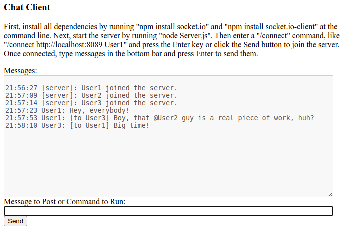

Chat Server and Client
======================

The code in this repository implements a rudimentary chat server and client in JavaScript, running in Node.JS and the browser.

</img>

Running a Server
----------------

* Make sure Node.JS is installed.
* From within the Source directory, open a command prompt and run the commands "npm install socket.io" and "npm install socket.io-client".
* Still within the Source directory, run the command "node Server.js" to run the chat server listening at the default url ("http://localhost:8089").

Running a Client
----------------
* In a web browser, open the Client.html.
* In the client, adjust the default connect command if necessary to use a unique username, and click the "Send" button to connect to the server.
* Type a message to send it to other users on the chat server.

Running an Agent
----------------
Several automated chat agents are included:

* Dice Roller
* Echo
* Rock, Paper, Scissors
* Tabletop Game Engine

To run one, open Agent.html in a web browser, select a type, and click the Connect button.  The agents will generally print usage instructions when joining the server.
